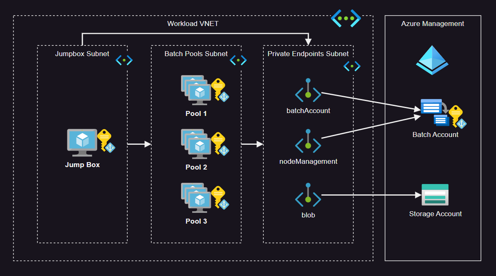

# Azure Batch

> You might have to submit a support to increase Batch quotas



Copy the `.auto.tfvars` file template:

```sh
cp config/template.tfvars .auto.tfvars
```

Create the account infrastructure:

```sh
terraform init
terraform apply -auto-approve
```

ℹ️ The pool will be provisioned with 0 nodes. Adjust your preferences accordingly.

Optionally, Configure your Batch account logs to be sent to the Log Analytics Workspace by setting up the Diagnostic Settings using the portal.

Use the script to create the application package:

```sh
bash scripts/create-batch-application.sh
```

Set the application to the pool:

```sh
az batch pool set \
  --account-name bafastbrains \
  --pool-id dev \
  --application-package-references "molecular-analysis#1.0"
```

One option to easily interact with the CLI is to login to the Batch account:

```sh
az batch account login \
  --name bafastbrains \
  --resource-group rg-fastbrains \
  --shared-key-auth
```
Alternatively, if you need to use the keys, add `--shared-key-auth`.

Run a task:

```sh
az batch task create --task-id sciTask001 --command-line "echo task001" --job-id dev-job
```

View task status:

```sh
az batch task show \
  --job-id dev-job \
  --task-id sciTask001
```

View task output

```sh
az batch task file list \
  --job-id dev-job \
  --task-id sciTask001 \
  --output table
```

It is possible to create a task with the [`--json-file`][1] option:

> The file containing the task(s) to create in JSON(formatted to match REST API request body). When submitting multiple tasks, accepts either an array of tasks or a TaskAddCollectionParamater. If this parameter is specified, all other parameters are ignored.

Additional functionality for the CLI is available through extensions:

```sh
az extension add --name azure-batch-cli-extensions
```

The Jumpbox already has System-Assigned Identity. To use it:

```sh
# Using the System-Assigned identity within the VM
az login --identity
```

This is not required if you use `az batch account login`, but another option to interact with a private endpoint Batch/pools using the Jumpbox:

```sh
export AZURE_BATCH_ACCOUNT=""
export AZURE_BATCH_ENDPOINT=""
export AZURE_BATCH_ACCESS_KEY=""
```

Now it is possible to use the private endpoints:

```
az batch pool list
```

## Reference

- [Azure Batch permissions](https://techcommunity.microsoft.com/t5/azure-paas-blog/the-usage-of-managed-identity-in-the-azure-batch-account-and/ba-p/3607014)
- [Private Endpoints + VM](https://learn.microsoft.com/en-us/troubleshoot/azure/general/azure-batch-pool-creation-failure#cause-1-public-network-access-is-disabled-but-batch-account-doesnt-have-private-endpoint)

[1]: https://learn.microsoft.com/en-us/cli/azure/batch/task?view=azure-cli-latest#az-batch-task-create
